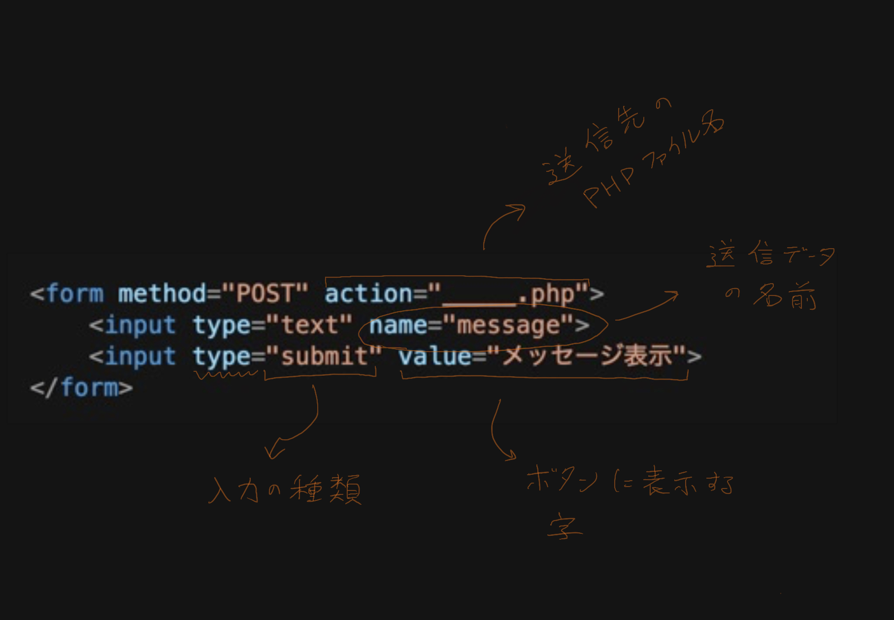

# 第２５講

## HTML から PHP にデータを送る



HTML からデータを送るときの鍵は上に書いてある\<form\>タグです。詳しくは１９講目のプリントを見てください。ここではさまざまな\<input\>タグの種類の例をみていきたいと思います。

## \<input\>の種類

- type="submit"

```html
<form method="POST" action="submit.php">
    <div>このボタンをクリックして送信してください。</div>
    <input type="submit" value="送信">
</form>
```

表示されると以下のようになります。

---
<div>このボタンをクリックして送信してください。</div>
<div><input type="submit" value="送信"></div>

---

<br>

- type="text"

```html
<form method="POST" action="submit.php">
    <div>ここに文を入力してください。</div>
    <input type="text" name="message">
    <input type="submit" value="送信">
</form>
```

表示されると以下のようになります。

---
<div>ここに文を入力してください。</div>
<input type="text" name="message">
<input type="submit" value="送信">

---

このデータを受け取るために、PHPファイルで$_POST変数を使います。

```php
<?php
$input = $_POST["message"]; // 入力された文を$inputという変数に格納します。
?>
```

- type="checkbox"

```html
<form method="POST" action="submit.php">
    <div>あなたが良く使うサイトを全て選択してください。</div>
    <input type="checkbox" name="youtube"> Youtube
    <input type="checkbox" name="twitter"> Twitter
    <input type="checkbox" name="instagram"> Instagram
    <div><input type="submit" value="送信"></div>
</form>
```

表示されると以下のようになります。

---
<div>あなたが良く使うサイトを全て選択してください。</div>
<input type="checkbox" name="youtube"> Youtube
<input type="checkbox" name="twitter"> Twitter
<input type="checkbox" name="instagram"> Instagram
<div><input type="submit" value="送信"></div>

---

このデータを受け取るために、PHPファイルで$_POST変数を使います。

```php
<?php
$yt = $_POST["youtube"]; // Youtubeがチェックされていたら、"on"が格納されます。
$tw = $_POST["twitter"]; // Twitterがチェックされていたら、"on"が格納されます。
$ig = $_POST["instagram"]; // Instagramがチェックされていたら、"on"が格納されます。

// チェックされていない変数は何も格納されません。空っぽの変数ができます。

if ($yt == "on") {
    // Youtube がチェックされていた場合に行う処理をこのようにif文を使って
    // 分けることができます。
}

?>
```


- type="radio"

```html
<form method="POST" action="submit.php">
    <div>次に使う技を選択してください。</div>
    <input type="radio" name="waza" value="10万ボルト"> 10万ボルト
    <input type="radio" name="waza" value="アイアンテール"> アイアンテール
    <br>
    <input type="radio" name="waza" value="ボルテッカー"> ボルテッカー
    <input type="radio" name="waza" value="なきごえ"> なきごえ
    <div><input type="submit" value="攻撃"></div>

</form>
```

表示されると以下のようになります。

---
<div>次に使う技を選択してください。</div>
<input type="radio" name="waza" value="10万ボルト" checked> 10万ボルト
<input type="radio" name="waza" value="アイアンテール"> アイアンテール
<br>
<input type="radio" name="waza" value="ボルテッカー"> ボルテッカー
<input type="radio" name="waza" value="なきごえ"> なきごえ
<div><input type="submit" value="攻撃"></div>

---

このデータを受け取るために、PHPファイルで$_POST変数を使います。

```php
<?php
$waza = $_POST["waza"]; // 選択された技のタグについてたvalueの文字列が格納されます

if ($waza == "10万ボルト") {
    // １０万ボルトを選択したときの処理

} else if ($waza == "アイアンテール") {
    // アイアンテールを選択したときの処理

} else if ($waza == "ボルテッカー") {
    // ボルテッカーを選択したときの処理

} else if ($waza == "なきごえ") {
    // なきごえを選択したときの処理

}

?>
```

## 練習

先週の練習問題を解くためのコードは書くことができましたが、新しい入力でプログラムを動かすにはコードを直接変えて再読み込みする必要があります。これだとコードを書けない人は使えないので、入力を受け取ってそれを処理できるようにコードを書いてみましょう。

新しく下記のコードを入れたファイルを作ってください。先週の一問目のためのデータを入力できるように書き換えてみてください。早く終わった人は他の問題のデータ送信にもチャレンジしてみてね！

```html
<!DOCTYPE html>
<html>
<head>
    <meta http-equiv="Content-Type" content="text/html; charset=UTF-8" />
</head>
<body>

    <form method="POST" action="practice1.php">
        <div>あなたの名前と年齢を教えてください。</div>
        <input>
    </form>

</body>
</html>
```

だんだんファイルが増えてきましたね。これをどんどん増やして管理するのは結構大変になってきていると思います。ここでLINUXの勉強をしていた時に使った「ディレクトリ」が役に立ちます！

新しく「practice」というディレクトリを作ってみてください。その中に前回の「practice1.php」をコピーしてみてください。最後に、新しく「index.html」というファイルを作って、上のコードをそこに入れてください。

今度はブラウザからいつものURLの代わりに、「...:8080/practice/index.html」
と入力すると今作ったファイルを見ることが出来ます。
また、「...:8080/practice」と入力しても同じベージが出てきます。URLにディレクトリ名だけを入れると、ブラウザはその中に「index.html」というファイルがあるかどうかを探し、あった場合は自動的にそれを表示してくれます。
