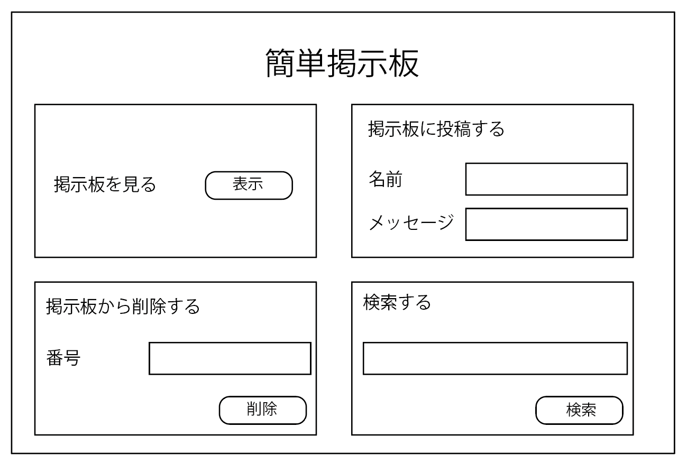

# 第３１講

## インターネットに公開する前に（２）

先週はインタネットに公開するためのセキュリティ面での準備を行いました。今日はほかの側面の準備として、サイトの見た目を整えましょう。

今の掲示板はしっかり機能はしているものの、見た目があまりよくないですね。サイトのデザインや見た目を作るのもとても奥が深いですが、少しの知識だけでも大きく見た目を変えることができます。今日はサイトの見た目を操作するためのHTMLとCSSについて勉強しましょう。

## すべては箱でできている

サイトのデザインを行うにあたってまず知っておくべきことは、サイトを構成する内容は全部「箱」に入ってると考えましょう。この箱が並べられてみんなが普段見ているサイトができています。まずはこの構成を実感してみましょう。

まずは、練習のためのHTMLファイルを作りましょう。`rensyuu.html`という名前のファイルを作り、以下のコードをコピーしてください。

```html
<!DOCTYPE html>
<html>
<head>
</head>
<body>
    <div>1</div>
    <div>2</div>
    <div>3</div>
</body>
</html>
```

上記の`<div>`の中身はそれぞれ「箱」形で内容を表示しています。今の状態だと少しわかりづらいので、色をつけてみましょう。

- タグが作っている箱に色をつける

```html
<div style="background-color: red"> </div>
```

三つのタグにそれぞれ背景の色をつけましょう。つけ終わってブラウザでこのページを確認すると、箱になってるのがわかりますね。この箱を使ってサイトを作っている仕組みのことを「ボックスモデル」といいます。

## 箱の構成

この箱を上手に使うにはまず箱の構成を理解することが大事です。箱は以下の四つのエリアで構成されています。


- **Content box**: 一番真ん中にはみんなが書いてきた文などの内容（コンテンツ、content）が入ります。この大きさは後で紹介する`width`や`height`といったプロパティで変更することができます。ボックスモデルの心臓部ですね。

- **Padding box**: パディングはコンテンツの周りに空白を入れる役目をします。文も密集してしまうと読みづらくなるので、これを使って空白の微調整を行います。

- **Border box**: 境界線を描くためのボックスです。周りに境界線を書きたい内容を書くことがある時はこれを使います。パディングを囲うのが一つのポイントです。

- **Margin box**: マージンは一番外側のボックスで、このボックスとほかのボックスとの間の距離を指定するために使います。

それでは実際に動かしながら覚えましょう。

以下のように`rensyuu.html`の`<head></head>`タグの中に新しく`<style></style>`タグを開いてみましょう。

```html
...

<head>
    <style>

    </style>
</head>

...
```

このスタイルタグを使うと同じ性質の箱のスタイルをまとめて設定することができます。今回は最初に`<div>`タグにスタイルをつけたいので`<style>`タグの中にこのように書いていきましょう。

```css
div {
    width: 100px;
    height: 70px;
    margin: 25px;
    padding: 25px;
    border: 5px solid black;
}
```

`<style>`タグの中ではスタイルをつけたいタグの名前を書き、その次のかっこの中に様々な設定をできます。上記のコードでは、`<div>`タグで挟んである内容の「箱」の設定を行っています。いろいろな値に設定してみるとわかりますが、箱が占める画面内での大きさ、境界線の色や太さ、ほかの箱との距離感など何通りか試してみるとイメージができるようになると思います。

## 箱の積み方

さてここまではサイトを構成する箱の仕組みを見てきました。箱の大きさなどの設定の方法を学べたので、次は箱の配置の方法を見ていきたいと思います。

箱は配置について何も設定していない状態だと縦にどんどん積まれるのが標準的な仕様です。しかし、たまには横に積んだり、少し複雑な積み方をしたいことも多いです。配置の設定法はいろいろありますが、今日は一つだけ紹介します。

今日紹介する配置の方法は「フレックスボックス」という方法です。

`rensyuu.html`のコードを以下のように変更してください。

```html
<!DOCTYPE html>
<html>
<head>
    <style>
        .flex-container {
            background-color: peru;    
        }

        .box {
            width: 100px;
            height: 70px;
            margin: 25px;
            padding: 25px;
            border: 5px solid black;
        }
    </style>
</head>
<body>
    <div class="flex-container">
        <div class="box" style="background-color: deepskyblue;">1</div>
        <div class="box" style="background-color: palegreen">2</div>
        <div class="box" style="background-color: palevioletred;">3</div>    
    </div>
</body>
</html>
```

今まであった三つの`<div>`タグの周りにもう一つの`<div>`タグをつけました。これはほかの三つのタグを囲う大きな箱になります。ここで、`<div>`のタグは一緒なのに役割が違う箱の種類ができました。これらを区別するのに使うのが`class`です。

`class`を設定すると、そのクラスがついてるタグだけを変更することができるようになります。今回は中身の箱を`box`というクラス名で設定しています。そして、スタイルの対象も、`div`から`.box`に変更します。クラス名のスタイルをつけるときはピリオドをつけて、クラス名を書きます。

そして、この三つの箱を入れる`<div>`に`class="flex-container"`とつけるとフレックスボックスの完成です。区別がしやすいように、これにも背景色をつけます。ブラウザで確認するとこの箱がほかの三つの箱を囲っているのがわかります。

フレックスボックスの本領発揮はここからです。`.flex-container`スタイルを以下のように変更します。

```css
.flex-container {
    display: flex;
    background-color: peru;
}
```

この状態でブラウザで確認してみましょう。フレックスボックスの中にほかの三つの箱がきれいに横に並んでいます。以下ではフレックスボックスに設定できるいくつかの配置法を紹介します。自分で追加しながらしようを確認してみてください。

## フレックスボックスの配置法

- 縦積みがしたい

```css
.flex-container {
    display: flex;
    flex-direction: column; /* フレックスボックス内の箱を縦に積みます */
}
```

- 自動的に『改行』をしたい

```css
.flex-container {
    display: flex;
    flex-wrap: wrap; /* 箱の数がフレックスボックスの横幅を超えたら改行する*/
}
```

- 箱を左からではなく、真ん中や右から並べたい

```css
.flex-container {
    display: flex;
    justify-content: center; /* 真ん中に箱を配置する。右の場合は'right' */
}
```

- 箱をフレックスボックスの上ではなく、真ん中から配置したい

```css
.flex-container {
    display: flex;
    align-items: center;
}
```

### フレックスボックス内の箱の設定

フレックスボックス本体だけでなく、その中の箱がどのように配置するかも細かく設定することができます。ここからは`<body>`内のコードを変更します。

- 箱の横幅の大きさの比率を設定したい

ここでは１対１対８の比率で中身の箱の横幅を設定します。

```html 
<div class="flex-container">
    <div class="box" style="flex-grow: 1; background-color: deepskyblue;">1</div>
    <div class="box" style="flex-grow: 1; background-color: palegreen">2</div>
    <div class="box" style="flex-grow: 8; background-color: palevioletred;">3</div>    
</div>
```

- 箱内の縦方向配置を設定したい

```html
<div class="flex-container" style="height: 200px;">
    <div class="box" style="background-color: deepskyblue;">1</div>
    <div class="box" style="align-self: center; background-color: palegreen">2</div>
    <div class="box" style="background-color: palevioletred;">3</div>    
</div>
```

これ以外にもフレックスボックスにはたくさんの細かい設定をすることができます。関心がある人は以下のリンクを参考にするといいかもしれません。

https://developer.mozilla.org/ja/docs/Learn/CSS/CSS_layout/Flexbox

## 掲示板の配置を見やすくしよう

それではここまで学んだことを使って掲示板の配置を直していきましょう。自分がイメージしたよい配置の仕方や背景色をつけたり、字の色を変えてみたり自由に変更してみましょう。

イメージがすぐにわかない人はまずは以下のような配置を目指してもいいかもしれません。

