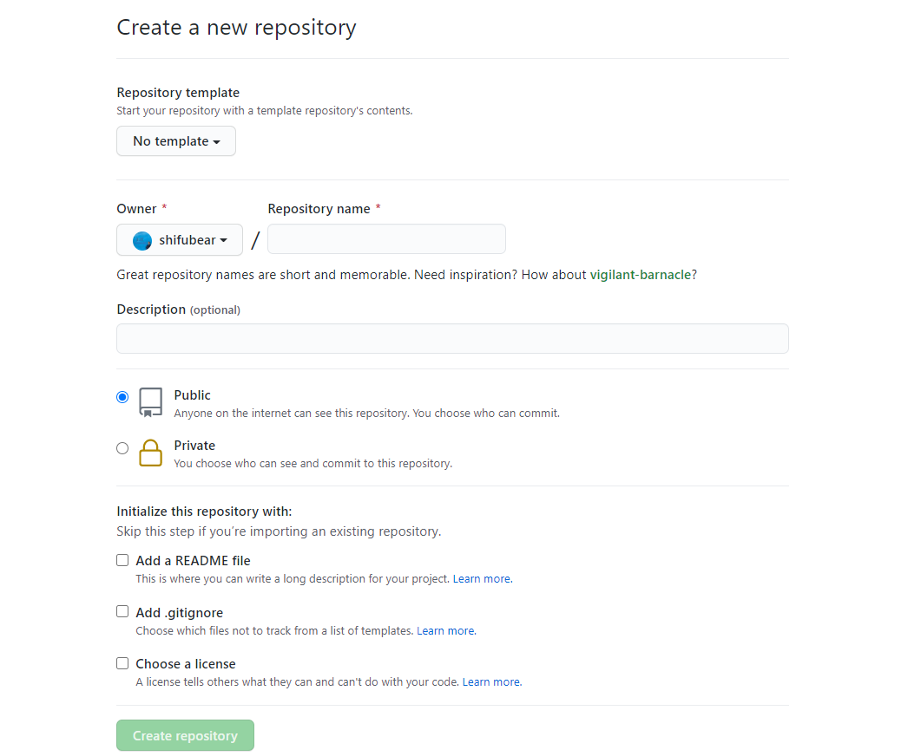

# 第３２講

## GITでバージョン管理と保管

今日はエンジニアたちが協力するために必要不可欠のツール、GitとGithubについて学びましょう。

Gitはエンジニアたちがプログラムのバージョンを管理したり、共同作業をしやすくするためのツールで世界中のエンジニアに愛用されてきました。今日は簡単な使い方を紹介して行きたいと思います。

## 準備

Gitについて学ぶ前に少しだけ準備をしておきましょう。

### a. ファイル構造の整理

簡単掲示板のファイル構造を一度整理しましょう。

今この状態だと思います:

```
├── www/ 
│   ├── html/
│   │   ├── keijiban.html
│   │   ├── keijiban_select.php
│   │   ├── keijiban_insert.php
│   │   ├── keijiban_delete.php
│   │   ├── keijiban_search.php
```

この掲示板関連のファイルをすべて一つのディレクトリに入れてしまいましょう。新しく`keijiban/`ディレクトリを作り、五つのファイルをその中にコピーします。コピー後は`keijiban.html`の名前を`index.html`に変更します。うまくできれば以下のファイル構造になります。

```
├── www/ 
│   ├── html/
│   │   ├── keijiban/                   <-
│   │   │   ├── index.html              <-
│   │   │   ├── keijiban_select.php
│   │   │   ├── keijiban_insert.php
│   │   │   ├── keijiban_delete.php
│   │   │   ├── keijiban_search.php
```

これで準備完了です。

### b. Gitのインストール

以下の手順はVisualStudioのターミナルからでも実行しましょう。まずはLinuxにGitをインストールしましょう。以下のコマンドを三つ順番に実行してみてください。

```bash
$ sudo apt-get update 
$ sudo apt-get install git 
$ git --version
```

無事インストールできればGitのバージョン番号が表示されます。

### c. Githubへの会員登録

次はGithubの会員登録を行いましょう。

以下のURLに行きましょう。

[Github](https://www.github.com/) (https://www.github.com)

画面中央に今回の授業のために作ってメールアドレスを入れて、"Sign up for GitHub"をクリックします。

その後、ユーザ名とパスワードを設定し、認証を行って"Create Account"をクリックします。その後の画面の手順を追っていけば認証メールが送られます。Gmailでメールを開き、届いたURLをクリックすれば会員登録完了です。

### d. GitとGithubの連動

それでは先ほどインストールしたGitと今作ったGithubのアカウントを連動させましょう。ターミナルで以下のコマンドを入力してください。メールアドレスはGithubに登録したものと一致するように。

```bash
$ git config --global user.email "メールアドレス"
```

## プロジェクトの作成

それではGithubから簡単掲示板の「リポジトリ」を作っていきましょう。リポジトリとは、プロジェクトについてのバージョンの情報などを保管するためのデータ構造です。今は詳細は気にせず、Githubに「自分のプロジェクトを入れる場所」だと考えるといいでしょう。

Githubの右上を見ると以下のように「プラス」があります。クリックしてみましょう。


クリックして出てきたメニューの「New repository」にクリックしてください。

すると以下のような画面が出てきます。



ここの"Repository name"のテキストボックスに`kantan-keijiban`と書きましょう。"Description"のテキストボックスはこのプロジェクトの簡潔な説明を入れることができます。いい機会なので"2020年度LAMP講座のプロジェクト"、または自分が入れたい掲示板についての一言をここに書きましょう。

ほかのオプションは今は気にしなくていいのでそのままにしておきます。

> 因みに、このような登録画面はまさにこの授業で勉強した`<form>`タグを使用してます！一度作ってみると、どんな感じでこのサイトが組まれてるか少しイメージできるようになったのではないでしょうか？この画面はすごく使いやすいようにできていますね。将来似たような画面を作る時に参考にできますね。このようにエンジニアとして知識をつけていくと、ほかのサイトやアプリを使うときに以後の参考になるようなページがたまにあります。新知識の練習をしたいときは、こういう自分が気に入った画面を作ってみるととてもいい練習になるので覚えておきましょう。

それでは"Create repository"ボタンをクリックしてリポジトリを完成させましょう！

以下のような画面がリポジトリ完成後に表示されます。


これでGithub側の準備は完了です。次はLinuxのGitで準備を進めましょう。

上の画像で矢印がついているURLをコピーしてください。コピーができたらターミナルで以下のコードを入力していきます。

```bash
$ git remote add origin コピーしたURL
$ git branch -M main
$ git push -u origin main
```

三つ目のコマンドを入力するとログインするためにブラウザが開かれます。手順に従ってログインを済ませればまたVisualStudioが開かれてターミナルに字が流れます。

これでGitとGithubを使う準備が完了しました。

## Gitの主要コマンド

それでは改めてGitを使うときに一番使われるコマンドについて学びましょう。

Gitは開発のタイムマシンのようなイメージです。一つの状態を登録すると、いつでもその状態に戻ってくることができます。何か大きな変更をして直せなくなったとき、最後正常に動いていた状態まで戻れるのでとても便利です。さらに、分岐もすることができて、新機能を二つ同時に実装したいとき、二人がそれぞれの新機能を実装するために分岐し、しっかり実装出来たら「元の世界線」にその機能を持ち込むことができます。

今日は状態の登録の方法だけを学んでいきたいと思います。ターミナルで`keijiban`ディレクトリに移動しておきましょう。

- リポジトリの状態をみる。

現在のリポジトリの状態を確認するためには以下のコマンドを使用します。

```bash
$ git status
```

赤い字でファイル名が表示されます。赤い字は、このディレクトリ内でリポジトリが管理していない変更があることを示します。これらの変更を記録するようにリポジトリに伝えましょう。

- リポジトリが管理するファイル、変更を仮登録する。

リポジトリに新しいファイルを仮登録させるためのコマンドの書式は以下の通りです。

```bash
$ git add 仮登録するファイル名
```

仮登録するファイル名をここにいくつでも書くことができます。さらに、現在のディレクトリ内のすべてのファイルを仮登録する場合は「.」を打つとすべて仮登録できます。

```bash
$ git add .
```

`keijiban`ディレクトリ内のファイルをすべて登録しておきましょう。この状態でもう一度

```bash
$ git status
```

を打ちましょう。仮登録されたファイルは緑色の字で表示されます。すべて緑になっていれば仮登録完了です。

- 変更を登録する

仮登録済みファイルがすべてそろったと確認できたら、今度は現在の変更を登録します。登録には以下のコマンドを使います。

```bash
$ git commit -m "変更内容"
```

登録するときは、必ず短く何を変更した方を書いておきましょう。最初の登録なので、"初登録"と入力しておきましょう。

これで、いろいろな変更をした後、この状態まで一気に戻りたくなったときは戻れるようになりました。「セーブポイント」ですね！普通の保存だとセーブファイルを一つしか作れませんが、Ｇｉｔを使うと複数のセーブポイントを登録することができます。便利ですね！

- 変更をGithubに投稿する

それでは最後に、変更したファイルをGithubに載せましょう。このようにネットに載せておけば、みんなが自分のパソコンを持つようになった時、そのパソコンにそのままここまでのプログラムをダウンロードすることができるようになります。

投稿するためには以下のコードを使います。

```bash 
$ git push origin master
```

実行が終了したら、ブラウザのGithubページを確認してみましょう。みんながこれまで頑張って書いたプログラムがしっかり載っています。

いろんな変更を書きながら上のコマンドを練習しましょう！